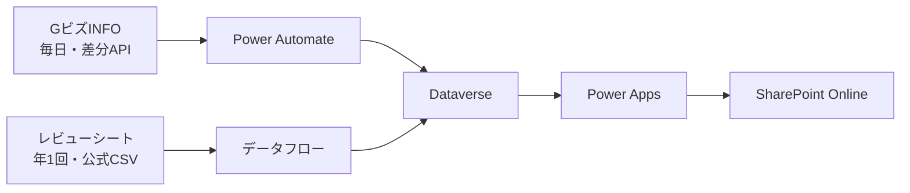

# 「事業者等への交付金額（経産省）」庁内移植手順

この文書は、GitHub Pagesで動いている説明用プロトタイプを、METI環境の **SharePoint Online＋Power Apps＋Dataverse＋Power Automate** で再構成するための手順書です。

対象読者はPower Appsを初めて使う担当者です。最初から完全自動化を目指さず、次の順番で作ります。

1. Dataverseにデータを置く
2. Power Appsで検索画面を作る
3. SharePointへ埋め込む
4. GビズINFOだけ日次更新する
5. レビューシートは年1回更新する

## 1. 完成形



庁内版では、GitHub、SPFx App Catalog、Entra IDアプリ、Azure Functionsを使いません。GitHub版は画面と要件を説明する見本として残します。

## 2. データの扱い

金額の意味が違うため、次の3系列は別テーブル・別タブのままにします。

| 画面のタブ | データ | 更新 | 意味 |
| --- | --- | --- | --- |
| 支出先別の実支出 | 行政事業レビュー | 年1回 | レビューシートに記載された支出先額 |
| 受取先別の契約・補助金 | GビズINFO | 毎日 | 契約額、交付・補助金掲載額 |
| 事業別の予算・執行額 | 行政事業レビュー | 年1回 | 事業全体の予算額・執行額 |

NEDO独自の月次契約CSVは初期版では取り込みません。ただし、GビズINFOに掲載されたNEDOのレコードはGビズINFO系列として取り込みます。

レビューシートは「レビュー実施年度」と「支出・執行対象年度」を別々に保存します。GビズINFOと比較するときは支出・執行対象年度を使います。

## 3. 最初にMETI PCで確認すること

作成を始める前に、次の項目を確認します。

- [ ] `make.powerapps.com`を開ける
- [ ] 使用する環境を右上の環境選択から選べる
- [ ] 左メニューからDataverseの「テーブル」を開ける
- [ ] 新しいテーブルを作成できる
- [ ] `make.powerautomate.com`を開ける
- [ ] クラウドフローで「HTTP」アクションを検索できる
- [ ] `api.info.gbiz.go.jp`への外部通信がPower Automateから許可される
- [ ] Canvasアプリを共有する対象者に必要なPower Apps利用権がある
- [ ] 対象SharePointサイトのページを編集できる

HTTPアクションが表示されない、または組織のポリシーで禁止されている場合、GビズINFOの日次自動更新だけが実装できません。検索画面とレビューシートの年次更新は先に作れます。

## 4. Solutionを先に作る

Power Appsの左メニューで「ソリューション」を開きます。

1. 「新しいソリューション」を選ぶ
2. 表示名を `事業者等への交付金額` とする
3. 名前は自動入力された値を使用する
4. 発行元はMETI環境で指定されているものを選ぶ
5. バージョンを `1.0.0.0` として保存する

以後、テーブル、アプリ、フローはこのSolutionの中に作ります。個人の「マイ フロー」だけに置かないことで、担当変更時に引き継ぎやすくなります。

## 5. Dataverseテーブルを作る

初期版では5テーブルを作ります。列の論理名は環境の発行元プレフィックスが付きます。以下の日本語名は表示名です。

### 5.1 Gビズ契約・補助金

主列の表示名を `受取先名` にします。

| 列 | 型 | 必須 | 用途 |
| --- | --- | --- | --- |
| ソースレコードキー | 1行テキスト（200） | 必須 | GビズINFOの`key_field`。重複防止キー |
| 法人番号 | 1行テキスト（13） | 任意 | 13桁。数値型にしない |
| 受取先名 | 1行テキスト（300） | 必須 | 法人・団体名 |
| 支出元機関 | 1行テキスト（200） | 必須 | 経済産業省、NEDO、IPA等 |
| 制度・事業名 | 複数行テキスト | 任意 | 補助金名・調達件名 |
| 金額 | 通貨 | 任意 | 未公表は空欄。0円にしない |
| 金額段階 | 選択肢 | 必須 | 契約額／補助金掲載額 |
| 契約・認定日 | 日付のみ | 任意 | GビズINFOの日付 |
| 年度 | 整数 | 必須 | 比較・絞り込み用 |
| 出典名 | 1行テキスト | 必須 | GビズINFO |
| 出典URL | URL | 任意 | 元データへのリンク |
| Gビズ最終更新日 | 日付のみ | 任意 | メタデータの`last_update_date` |
| 有効 | はい／いいえ | 必須 | 通常は「はい」 |

テーブルの「キー」から、`ソースレコードキー`を代替キーとして登録します。キーの状態が「アクティブ」になるまで数分かかる場合があります。

### 5.2 レビュー支出先

| 列 | 型 | 必須 | 用途 |
| --- | --- | --- | --- |
| 取込キー | 1行テキスト（300） | 必須 | 年度・事業ID・支出行を組み合わせたキー |
| レビュー実施年度 | 整数 | 必須 | 例：2025 |
| 支出対象年度 | 整数 | 必須 | 例：2024 |
| レビュー事業ID | 1行テキスト | 必須 | RSシステムの事業ID |
| 事業名 | 複数行テキスト | 必須 | レビューシート事業名 |
| 受取先名 | 1行テキスト（300） | 必須 | 支出先名 |
| 法人番号 | 1行テキスト（13） | 任意 | 記載がない受取先も保存する |
| 支出元機関 | 1行テキスト | 必須 | 経済産業省、実施機関等 |
| 支出先額 | 通貨 | 必須 | レビューシート記載額 |
| 資金レイヤー | 選択肢 | 必須 | 最終受取先／実施機関・中間受取先／経路未分類 |
| 資金経路 | 複数行テキスト | 任意 | 経済産業省→NEDO→受取先等 |
| 出典URL | URL | 任意 | RSシステム |
| 取込バッチID | 1行テキスト | 必須 | 例：`review-2025-20260831` |
| 現行版 | はい／いいえ | 必須 | 画面には「はい」だけ表示 |

`取込キー`を代替キーにします。

### 5.3 レビュー事業

| 列 | 型 | 必須 | 用途 |
| --- | --- | --- | --- |
| 取込キー | 1行テキスト | 必須 | レビュー年度＋事業ID |
| レビュー実施年度 | 整数 | 必須 | シート公表年度 |
| レビュー事業ID | 1行テキスト | 必須 | RSシステム事業ID |
| 事業名 | 複数行テキスト | 必須 | 事業名 |
| 担当組織 | 1行テキスト | 必須 | 経済産業省内の担当組織 |
| 予算年度 | 整数 | 任意 | 予算額の年度 |
| 当初予算 | 通貨 | 任意 | 未記載は空欄 |
| 歳出予算現額 | 通貨 | 任意 | 未記載は空欄 |
| 執行対象年度 | 整数 | 任意 | 執行額の年度 |
| 執行額 | 通貨 | 任意 | 事業全体の執行額 |
| 執行率 | 小数 | 任意 | 0～1で保存 |
| 出典URL | URL | 任意 | RSシステム |
| 取込バッチID | 1行テキスト | 必須 | 年次取込の識別子 |
| 現行版 | はい／いいえ | 必須 | 現在表示する版 |

`取込キー`を代替キーにします。

### 5.4 年度別集計

Power Apps上で大量行を直接合計しないための小さな集計テーブルです。

| 列 | 型 | 用途 |
| --- | --- | --- |
| 集計キー | 1行テキスト | `年度-系列` |
| 年度 | 整数 | 表示年度 |
| 系列 | 選択肢 | 実支出先／中間受取先／契約・補助金／事業執行 |
| 金額合計 | 通貨 | 事前計算した合計 |
| 件数 | 整数 | 事前計算した件数 |
| 更新日時 | 日時 | 集計日時 |

`集計キー`を代替キーにします。

### 5.5 同期履歴

| 列 | 型 | 用途 |
| --- | --- | --- |
| 同期名 | 1行テキスト | GビズINFO日次、レビュー2026等 |
| データソース | 選択肢 | GビズINFO／レビューシート |
| 開始日時 | 日時 | 開始時刻 |
| 終了日時 | 日時 | 終了時刻 |
| 状態 | 選択肢 | 実行中／成功／失敗／要確認 |
| 取得件数 | 整数 | API・CSVの件数 |
| 登録件数 | 整数 | Dataverse反映件数 |
| エラー内容 | 複数行テキスト | 失敗時だけ |

## 6. 初回データを入れる

### 6.1 GビズINFO

初回だけ、GビズINFOの全件CSVを使います。約85万行をPower Automateで1行ずつ処理しません。

1. METI PCでGビズINFOの補助金CSVと調達CSVを取得する
2. Power Appsのデータフロー、またはPower QueryでCSVを開く
3. 支出元機関を次の対象に絞る
   - 経済産業省
   - 資源エネルギー庁
   - 中小企業庁
   - 特許庁
   - NEDO
   - IPA
   - 必要に応じて各地方経済産業局
4. 必要列だけ残す
5. `ソースレコードキー`へGビズINFOのキー情報を設定する
6. `Gビズ契約・補助金`テーブルへ読み込む
7. 件数と金額をGitHub版の概数と照合する

初回取込後は、全CSVを毎日取得しません。

### 6.2 レビューシート

1. RSシステムのCSVダウンロード画面から対象年度を取得する
2. 経済産業省の事業だけ残す
3. 支出先明細を`レビュー支出先`へ読み込む
4. 予算・執行明細を`レビュー事業`へ読み込む
5. レビュー実施年度と支出・執行対象年度が混ざっていないことを確認する
6. 同一年度・同一事業を再取込する場合は、旧バッチの`現行版`を「いいえ」にしてから新バッチを表示する

現在のGitHub版では、詳細な支出先を確認できる2024・2025年度レビューシートを主な集計対象としています。旧移行年度は支出経路が不足する場合があるため、同じ完全性として合算しません。

## 7. Canvasアプリを作る

### 7.1 アプリの新規作成

1. 作成したSolutionを開く
2. 「新規」→「アプリ」→「キャンバス アプリ」を選ぶ
3. 名前を `事業者等への交付金額` とする
4. タブレット向けの横長レイアウトを選ぶ
5. データから次の5テーブルを追加する
6. 保存する

### 7.2 画面構成

1画面に次の順で配置します。

1. タイトルと最終更新日時
2. 年度別集計カード
3. 3つの切替タブ
4. 検索欄、支出元、年度、金額段階の絞り込み
5. 結果ギャラリー
6. データソースと更新状態

タブは3つのボタンで作ります。各ボタンの`OnSelect`へ次を設定します。

```powerfx
Set(varView, "payments")
```

```powerfx
Set(varView, "commitments")
```

```powerfx
Set(varView, "programs")
```

アプリの`OnStart`には次を設定します。

```powerfx
Set(varView, "payments");
Set(varFiscalYear, Blank())
```

異なるテーブルを1つのギャラリーへ無理に切り替えず、ギャラリーを3つ用意します。

- 支出先ギャラリーの`Visible`：`varView = "payments"`
- Gビズギャラリーの`Visible`：`varView = "commitments"`
- 事業ギャラリーの`Visible`：`varView = "programs"`

支出先ギャラリーの`Items`例です。実際のテーブル名・列名は環境に合わせて選択候補から入れてください。

```powerfx
SortByColumns(
    Filter(
        'レビュー支出先',
        現行版 = true,
        IsBlank(txtSearch.Text)
            || StartsWith(受取先名, txtSearch.Text)
            || StartsWith(事業名, txtSearch.Text)
            || 法人番号 = txtSearch.Text,
        IsBlank(cmbYear.Selected.Value)
            || 支出対象年度 = Value(cmbYear.Selected.Value)
    ),
    "支出対象年度",
    SortOrder.Descending,
    "受取先名",
    SortOrder.Ascending
)
```

大量データでは、検索結果をローカルのコレクションへ全件読込みしません。`StartsWith`等、Dataverseへ委任できる条件を中心にします。青い波線や委任警告が出た式は、そのまま本番にしません。

年度別の金額カードは、明細を`Sum`して作るのではなく、`年度別集計`テーブルから1件取得して表示します。

### 7.3 表示上の注意

- 空欄金額は「未公表」と表示する
- 0円へ置換しない
- 実支出、契約・補助金、予算・執行を合算しない
- レビュー実施年度と支出対象年度を併記する
- NEDO独自CSVを使っていないことをデータソース欄へ明記する
- 出典URLをクリックできるようにする

## 8. GビズINFO日次差分フローを作る

### 8.1 利用するAPI

補助金：

```text
GET https://api.info.gbiz.go.jp/hojin/v2/hojin/updateInfo/subsidy
```

調達：

```text
GET https://api.info.gbiz.go.jp/hojin/v2/hojin/updateInfo/procurement
```

共通パラメータ：

| 名前 | 値 |
| --- | --- |
| `from` | 取得開始日、`yyyyMMdd` |
| `to` | 取得終了日、`yyyyMMdd` |
| `page` | 1から開始 |
| `metadata_flg` | `true` |

HTTPヘッダー：

```text
X-hojinInfo-api-token: 発行されたAPIトークン
```

APIトークンはフローの実行履歴へ表示しないよう、HTTPアクションの設定で入力・出力のセキュリティ保護を有効にします。トークンをSharePoint、Dataverseの通常列、GitHubへ保存しません。

### 8.2 日付の設定

毎日、当日だけではなく直近7日間を重ねて取得します。

開始日：

```text
formatDateTime(convertTimeZone(addDays(utcNow(),-7),'UTC','Tokyo Standard Time'),'yyyyMMdd')
```

終了日：

```text
formatDateTime(convertTimeZone(utcNow(),'UTC','Tokyo Standard Time'),'yyyyMMdd')
```

同じレコードを再取得しても`key_field`で既存行を更新するため、重複しません。この重なりによって遅れて登録・訂正されたデータを拾います。

### 8.3 フローの作成順

1. Solution内で「新規」→「自動化」→「クラウド フロー」→「スケジュール済み」を選ぶ
2. 名前を `GビズINFO日次差分取込` とする
3. 開始時刻を午前6時30分、タイムゾーンを東京にする
4. `同期履歴`に「実行中」の行を追加する
5. 整数変数`Page`を1で初期化する
6. 補助金APIをHTTP GETで呼ぶ
7. 応答JSONを解析する
8. `hojin-infos`内の`subsidy`配列を処理する
9. 対象機関だけ残す
10. `meta-data.key_field`でDataverseを検索する
11. 存在すれば行を更新、なければ行を追加する
12. `Page`を1増やし、`totalPage`まで繰り返す
13. 調達APIについても同じ処理を行う
14. 年度別集計を更新する
15. `同期履歴`を「成功」に更新する

初期版は、日次差分件数が小さいことを前提に「Dataverseの行を一覧表示→存在確認→追加または更新」で構いません。全85万行をこの処理へ通さないことが重要です。

フローの失敗分岐では次を行います。

1. `同期履歴`を「失敗」に更新する
2. エラー内容を保存する
3. 担当者へTeamsまたはメールで通知する
4. 既存データは削除しない

## 9. レビューシートの年次更新

レビューシートは日次APIにしません。年1回の公表後に年度分を追加します。

### 推奨する初期運用

1. 8月末以降、RSシステムから最新年度CSVをMETI PCへ取得する
2. 承認されたSharePointの取込用ライブラリへ置く
3. `レビューシート年次取込`データフローを手動更新する
4. 経済産業省分だけを抽出する
5. `レビュー支出先`と`レビュー事業`へ読み込む
6. 新バッチの件数・金額・対象年度を確認する
7. 問題がなければ新バッチを`現行版＝はい`にする
8. 同年度の旧バッチを`現行版＝いいえ`にする
9. `年度別集計`を再計算する
10. `同期履歴`へ成功件数を記録する

ファイル名や列構成が年度更新時に変わる可能性があるため、初期版は年1回の手動開始を推奨します。運用が安定した後、8月下旬から9月中旬だけ週1回公表を確認するフローへ拡張します。

## 10. SharePointへ埋め込む

1. Canvasアプリを保存して公開する
2. 利用者またはMETI内の対象セキュリティグループへアプリを共有する
3. 利用者にDataverseの読み取り権限を付与する
4. 対象SharePointサイトで新しいページを作る
5. 1列の全幅に近いセクションを追加する
6. 「Power Apps」Webパーツを追加する
7. 公開したCanvasアプリのWebリンクまたはアプリIDを設定する
8. ページを下書き保存する
9. 権限の異なるテスト利用者で表示確認する
10. 問題がなければSharePointページを公開する

SharePointページへ埋め込んだだけでは、アプリやDataverseの権限は自動では付与されません。アプリ共有、Dataverse権限、利用ライセンスを別々に確認します。

## 11. 権限の最小構成

| 対象 | 作成担当 | 一般利用者 |
| --- | --- | --- |
| Canvasアプリ | 所有者・共同所有者 | 実行 |
| Gビズ契約・補助金 | 作成・読取・更新 | 読取 |
| レビュー支出先 | 作成・読取・更新 | 読取 |
| レビュー事業 | 作成・読取・更新 | 読取 |
| 年度別集計 | 作成・読取・更新 | 読取 |
| 同期履歴 | 作成・読取・更新 | 読取 |
| Power Automate | 所有者・共同所有者 | 不要 |
| SharePointページ | 編集 | 閲覧 |

フローを個人1人だけの所有にしません。少なくとも共同所有者と、接続が無効になった場合の引継ぎ方法を決めます。

## 12. 公開前テスト

### データ

- [ ] GビズINFOの法人番号は13桁の文字列になっている
- [ ] 金額空欄を0円にしていない
- [ ] NEDO独自CSVのレコードが混ざっていない
- [ ] GビズINFOに掲載されたNEDO分は残っている
- [ ] レビュー実施年度と支出対象年度が分かれている
- [ ] 支出先額と事業執行額を合算していない
- [ ] 同じ`key_field`のGビズ行が重複していない

### 画面

- [ ] 3タブが切り替わる
- [ ] 受取先名、法人番号、事業名で検索できる
- [ ] 年度で絞り込める
- [ ] 出典を開ける
- [ ] 0件時に読み込み中のままにならない
- [ ] PCのSharePointページ幅で横スクロールが不自然に出ない
- [ ] 一般利用者権限で表示できる

### 更新

- [ ] GビズINFOフローを手動実行して成功する
- [ ] 同じ7日間を2回実行しても件数が重複しない
- [ ] APIエラー時に既存データが消えない
- [ ] 同期履歴に開始・終了・件数・状態が残る
- [ ] レビューCSVをテスト年度で再取込できる

## 13. 運用カレンダー

| 時期 | 作業 |
| --- | --- |
| 毎日6:30 | GビズINFOの直近7日差分を自動取込 |
| 毎週 | 同期履歴の失敗有無だけ確認 |
| 四半期 | GビズINFO全件との件数照合。毎日取込はしない |
| 8月末～9月 | 新年度レビューシートを1回取込 |
| 担当異動前 | アプリ、フロー、接続、手順書の共同所有者を確認 |

## 14. 困ったときの切り分け

| 症状 | 最初に確認すること |
| --- | --- |
| HTTPが見つからない | コネクタ利用権・DLPポリシー |
| GビズINFOが401/403 | APIトークン、ヘッダー名、利用制限 |
| GビズINFOが0件 | `from`・`to`の日付形式、対象期間、ページ番号 |
| 重複する | `metadata_flg=true`、`key_field`、代替キー |
| Power Appsが一部しか検索しない | 委任警告、`StartsWith`を使っているか |
| SharePointでアプリが見えない | アプリ共有、Dataverse権限、ライセンス |
| レビュー年度がずれる | レビュー実施年度と支出対象年度の列マッピング |
| ずっと読み込み中 | 失敗時・0件時にローディング変数を解除しているか |

## 15. 公式資料

- [GビズINFO REST API](https://content.info.gbiz.go.jp/api/index.html)
- [GビズINFO API仕様（Swagger）](https://api.info.gbiz.go.jp/hojin/swagger-ui/index.html?urls.primaryName=v2)
- [行政事業レビューCSV](https://rssystem.go.jp/download-csv)
- [Dataverseを使ったCanvasアプリの作成](https://learn.microsoft.com/ja-jp/power-apps/maker/canvas-apps/data-platform-create-app-scratch)
- [Dataverseの代替キー](https://learn.microsoft.com/ja-jp/power-apps/maker/data-platform/define-alternate-keys-portal)
- [SharePointのPower Apps Webパーツ](https://learn.microsoft.com/ja-jp/power-apps/user/powerapps-web-part)

